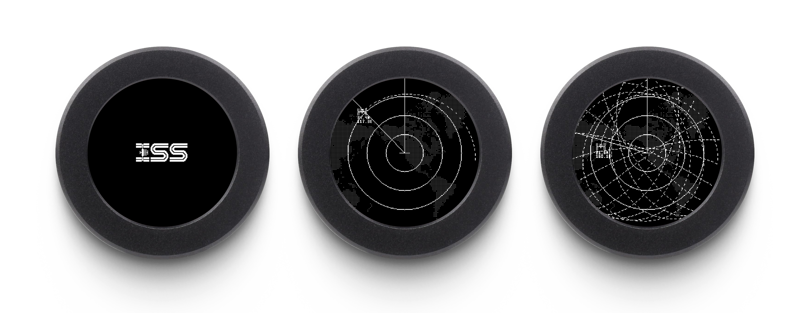
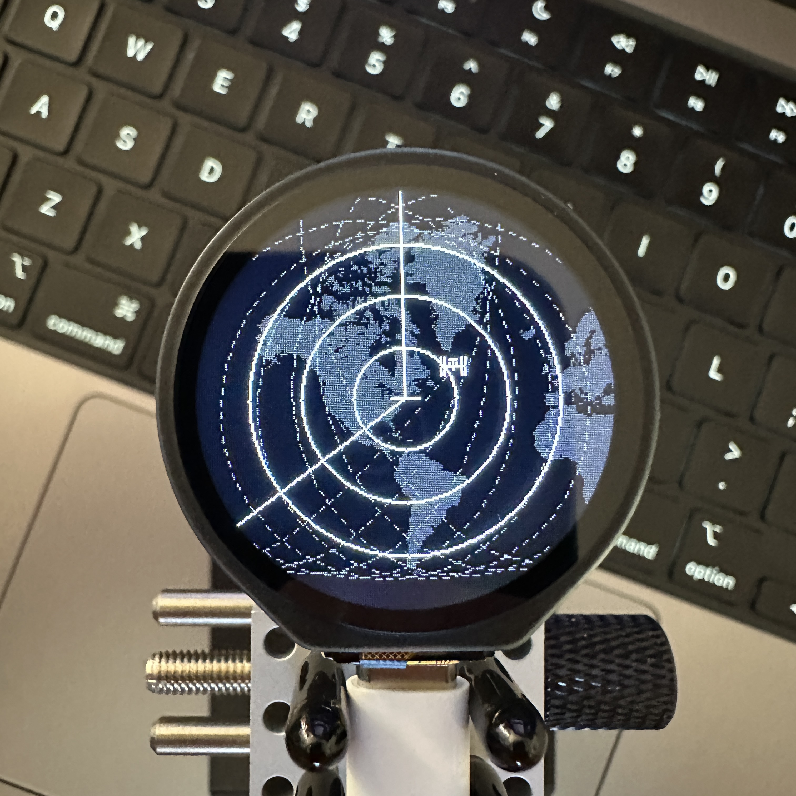

```
                    @         @                 @@@@@       @         @@@@@@@@@@
                  @@@       @@@             @@@@@@@@@@@@@   @@@       @@@@@@@@@@
               @@@@@@    @@@@@@           @@@@@@@@@@@@@@@@@ @@@@@@    @@@@@@@@@@
             @@@@@@@@  @@@@@@@@          @@@@@@@@@@@@@@@@@@@@@@@@@@@  @@@@@@@@@@
          @@@@@@@@@@@@@@@@@@@@@   @@@   @@@@@@@@@@@@@@@@@@@@@@@@@@@@@@@@@@@@@@@@
        @@@@@@@@@@@@@@@@@@@@@@X@@@@@@@@@ @@@@@@@@@@@@@@@@@@@@@@@@@@@@@@@@@@@@@@@
     @@@@@@@@@@@@@@@@@@@@@@@@@@@@@@@@@@@@ @@@@@@@@@@@@@@@@@ @@@@@@@@@@@@@@@@@@@@
   @@@@@@@@@@@@@@@@@@@@@@@@@@@X@@@@@@@@@    @@@@@@@@@@@@@   @@@@@@@@@@@@@@@@@@@@
@@@@@@@@@@@@@@@@@@@@@@@@@@@@@@    @@@           @@@@@       @@@@@@@@@@@@@@@@@@@@

                  @@@@@@      @@@@@@@@@@@@@@@@@@@@          @@@@@@@@@@@@@@@@@@@@
              @@@@@@@@@@@@@   @@@@@@@@@@@@@@@@@@@@          @@@@@@@@@@@@@@@@@@@@
            @@@@@@@@@@@@@@@@@ @@@@@@@@@@@@@@@@@@@@    @@@   @@@@@@@@@@@@@@@@@@@@
           @@@@@@@@@@@@@@@@@@@@@@@@@@@@@@@@@@@@@@@ @@@@@@@@@@@@@@@@@@@@@@@@@@@@@
@@@@@@@@@@@@@@@@@@@@@         @@@@@@@@@@@@@@@@@@@@@@@@@@@@@@     @@@@@@@@@@
 @@@@@@@@@@@@@@@@@@@          @@@@@@@@@@@@@@@@@@@@ @@@@@@@@@     @@@@@@@@@@
   @@@@@@@@@@@@@@@            @@@@@@@@@@@@@@@@@@@@    @@@        @@@@@@@@@@
      @@@@@@@@                @@@@@@@@@@@@@@@@@@@@               @@@@@@@@@@
```

# Moonshot ISS Tracker

A realtime International Space Station tracker that runs on a tiny 1.28-inch round LCD display. It plots the ISS position as a radar blip relative to your location, with a rotating sweep line and dashed trajectory trail.

The surprise discovery: leave it running for a few hours and the orbital trail produces beautiful spirographic mandala patterns. The ISS completes an orbit every ~90 minutes at a 51.6-degree inclination, and because the Earth rotates beneath it, the dashed trail traces sinusoidal curves that overlap into intricate geometric forms — revealing the curvature of the Earth in miniature.





## Hardware

- **Board:** [ESP32-S3-Touch-LCD-1.28](https://www.waveshare.com/esp32-s3-touch-lcd-1.28.htm) (Waveshare)
- **Display:** 1.28" round GC9A01 LCD, 240x240 pixels, RGB565 color
- **Interface:** SPI at 80MHz

## How It Works

- Fetches the ISS position every 30 seconds from the [Open Notify API](http://open-notify.org/)
- Calculates distance and bearing from your location using the Haversine formula
- Renders a radar view with range rings, a north line, and a rotating sweep
- Draws the ISS as a pixel-art silhouette with coordinates shown when the sweep passes over it
- Leaves a dashed trail behind the ISS (up to 1000 points) that accumulates into the spirographic patterns
- Shows a world map background centered on your location
- If the ISS is out of range, an arrow marker points toward it from the radar edge

## Setup

1. Flash [MicroPython](https://micropython.org/download/ESP32_GENERIC_S3/) onto the ESP32-S3
2. Edit `iss-tracker.py` and set your WiFi credentials and location:
   ```python
   WIFI_SSID = "your_network"
   WIFI_PASSWORD = "your_password"
   USER_LAT = 40.7128      # your latitude
   USER_LON = -74.0060     # your longitude
   ```
3. Copy all `.py` files to the device
4. The tracker starts automatically on boot

## Files

| File | Description |
|------|-------------|
| `iss-tracker.py` | Main application |
| `lcd_1inch28.py` | Display driver for the GC9A01 round LCD |
| `boot_logo.py` | Boot animation image data (RGB565) |
| `iss_icon.py` | ISS silhouette sprite (15x11 pixels) |
| `world_map.py` | World map bitmap (344x207 pixels) |
| `convert_screenshot.py` | Converts device screenshots (RGB565) to PNG — runs on host computer |
